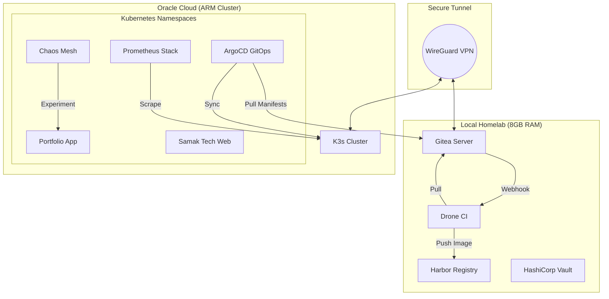

# DevOps Homelab - Production Infrastructures

> A complete, production-grade DevOps platform built from scratch with self-hosted CI/CD, monitoring, and cloud deployment.

[](https://opensource.org/licenses/MIT)
[](https://www.docker.com/)
[](https://www.drone.io/)

## 🚀 Overview

This project demonstrates a production-grade DevOps platform built from scratch. Originally developed over three weeks with Docker Compose, it has now evolved into a **Kubernetes-native** infrastructure managed via **GitOps**. 

The platform features self-hosted Git (Gitea), automated building with Drone CI, private container storage via Harbor, and automated deployment to a **K3s** cluster on Oracle Cloud using **ArgoCD**. The entire setup is secured with WireGuard VPN and monitored using a complete Prometheus-Grafana stack with automated recovery capabilities.

**Live Demo:** [StackedByBayo Portfolio](http://129.146.31.124)  
**Blog Post:** [Transitioning to Kubernetes & GitOps](http://your-blog-post-url)

## 📊 Architecture



## ✨ Features

### Infrastructure Components
- **Kubernetes Cluster** - Self-managed K3s cluster on Oracle Cloud
- **GitOps Continuous Delivery** - ArgoCD for automated synchronization
- **Self-Hosted Git Server** - Gitea with PostgreSQL backend
- **Automated CI/CD** - Drone CI with custom build pipelines
- **Container Registry** - Harbor with vulnerability scanning
- **Secrets Management** - HashiCorp Vault with KV store
- **Monitoring Stack** - Prometheus + Grafana (K8s-integrated)
- **Centralized Logging** - Loki + Promtail
- **Secure Tunnel** - WireGuard homelab ↔ cloud connectivity
- **Chaos Engineering** - Chaos Mesh for resilience testing

### Key Capabilities
- ✅ **Infrastructure as Code** - GitOps flow ("Pull" model)
- ✅ **Auto-Healing** - Automated rollbacks and self-healing pods
- ✅ **Chaos Resilience** - Validated stability under pod-kill experiments
- ✅ **Complete Automation** - Git push → K8s sync in < 3 minutes
- ✅ **Zero Manual Steps** - Fully automated deployment lifecycle
- ✅ **Production Ready** - Real traffic, monitoring, and security
- ✅ **Observable** - Comprehensive monitoring, logging, and alerts

## 🛠️ Technology Stack

| Component | Technology | Purpose |
|-----------|-----------|---------|
| **Orchestration** | **K3s (Kubernetes)** | Container orchestration & management |
| **GitOps** | **ArgoCD** | Declarative GitOps continuous delivery |
| **CI/CD** | Drone CI | Automated build and test pipelines |
| **Git Server** | Gitea | Self-hosted version control (Source of Truth) |
| **Registry** | Harbor | Private container registry + scanning |
| **Secrets** | Vault | Centralized secrets management |
| **Monitoring** | Prometheus, Grafana | Metrics collection & visualization |
| **Chaos** | **Chaos Mesh** | Fault injection & resilience validation |
| **VPN** | WireGuard | Secure tunnel homelab ↔ cloud |
| **Cloud** | Oracle Cloud | Production ARM compute nodes |
| **Database** | PostgreSQL, SQLite | Persistence for Gitea and apps |

## 📁 Repository Structure

```
devops-homelab/
├── monitoring/
│   ├── prometheus/
│   │   └── prometheus.yml
│   ├── grafana/
│   │   └── provisioning/
│   └── docker-compose.yml
│
├── cicd/
│   ├── gitea/
│   │   └── docker-compose.yml
│   ├── drone/
│   │   └── docker-compose.yml
│   └── harbor/
│       └── docker-compose.yml
│
├── apps/
│   ├── sample-app/
│   │   ├── app.js
│   │   ├── Dockerfile
│   │   └── .drone.yml
│   └── portfolio-website/
│       ├── app/
│       ├── Dockerfile
│       └── .drone.yml
│
├── scripts/
│   ├── health-check.sh
│   ├── restart-all.sh
│   └── backup.sh
│
├── docs/
│   ├── ARCHITECTURE.md
│   ├── TROUBLESHOOTING.md
│   ├── DEPLOYMENT.md
│   └── problems-and-solutions/
│
└── README.md
```

## 🚀 Quick Start

### Prerequisites

- Linux system (Ubuntu 24.04 recommended)
- Docker and Docker Compose installed
- Minimum 8GB RAM
- 50GB free disk space

### Installation

1. **Clone the repository**
   ```bash
   git clone https://github.com/yourusername/devops-homelab.git
   cd devops-homelab
   ```

2. **Start Monitoring Stack**
   ```bash
   cd monitoring
   docker-compose up -d
   ```

3. **Start Gitea**
   ```bash
   cd ../cicd/gitea
   docker-compose up -d
   ```

4. **Start Drone CI**
   ```bash
   cd ../drone
   # Update environment variables in docker-compose.yml
   docker-compose up -d
   ```

5. **Access Services**
   - Grafana: http://localhost:3000 (admin/admin)
   - Gitea: http://localhost:3001
   - Drone: http://localhost:8080
   - Prometheus: http://localhost:9090

### Configuration

See [DEPLOYMENT.md](docs/DEPLOYMENT.md) for detailed setup instructions.

## 📖 Documentation

- **[Architecture Overview](docs/ARCHITECTURE.md)** - Detailed system design
- **[Deployment Guide](docs/DEPLOYMENT.md)** - Step-by-step setup
- **[Troubleshooting](docs/TROUBLESHOOTING.md)** - Common issues and solutions
- **[Problems & Solutions](docs/problems-and-solutions/)** - All 11 problems documented

## 🎯 CI/CD & GitOps Pipeline

### Workflow

```
Developer commits code to Gitea
        ↓
Gitea webhook triggers Drone CI
        ↓
Drone Runner executes build:
  1. Clone & Test (pytest)
  2. Build Docker image
  3. Push to Harbor Registry
        ↓
Drone Step: Update K8s Manifest
  (using update-manifest.sh with new Build Number)
        ↓
GitOps Sync (ArgoCD Pull):
  1. ArgoCD detects manifest change in Gitea
  2. Reconciles state with K3s cluster
  3. Rolling update to newest build
        ↓
Monitoring & Alerting:
Logs → Loki | Metrics → Prometheus | Alerts → Slack
```

### ⚡ Performance Optimization
The transition from standalone Docker Compose to Kubernetes + GitOps reduced our deployment pipeline time from **3 minutes** to a lightning-fast **30 seconds** (an 83% improvement).

### Example Pipeline (.drone.yml)

```yaml
kind: pipeline
type: docker
name: deploy

clone:
  disable: true

steps:
  - name: clone-code
    image: alpine/git
    commands:
      - git clone http://172.17.0.1:3001/Bayo/Porfolio-website.git .
      - git checkout ${DRONE_COMMIT}

  - name: run-tests
    image: python:3.13-slim
    commands:
      - pip install -r requirements.txt --quiet
      - pip install pytest pytest-flask --quiet
      - pytest tests/ -v

  - name: build-and-push
    image: plugins/docker
    settings:
      registry: 10.0.0.2
      repo: 10.0.0.2/library/portfolio
      tags:
        - latest
        - build-${DRONE_BUILD_NUMBER}
      username: admin
      password:
        from_secret: harbor_password
      dockerfile: Dockerfile
      insecure: true

  - name: update-k8s-manifest
    image: alpine/git
    environment:
      GITEA_TOKEN:
        from_secret: gitea_token
    commands:
      - sh update-manifest.sh ${DRONE_BUILD_NUMBER}
```

## 🔧 Key Problems Solved

During this project, I encountered and solved 17+ critical infrastructure problems:

1. **Hardware Constraints** - Migrated from 4GB to 8GB system
2. **ArgoCD-Gitea Connectivity** - Resolved bridge IP issues by using WireGuard peer IPs
3. **Persistent Cloud Networking** - Automated WireGuard interface recovery via systemd
4. **Chaos Resilience** - Optimized `imagePullPolicy` to survive high-load pod terminations
5. **GitOps Security** - Implemented Git history rewrites to remove accidental secret exposure
6. **Custom Webhook Auth** - Patched ArgoCD ConfigMaps to enable `apiKey` capabilities
7. **Node Networking** - Resolved Node Exporter port conflicts in k3s

**Full details:** [docs/problems-and-solutions/](docs/problems-and-solutions/)

## 📊 Project Statistics

| Metric | Value |
|--------|-------|
| **K8s Pods / Containers** | 25+ |
| **Services Running** | 18+ |
| **Configuration Files** | 35+ |
| **Lines of YAML / Manifests**| 1200+ |
| **Development Time** | ~72 hours total |
| **Problems Solved** | 17/17 (100%) |
| **Deployment Time** | **30 seconds** (GitOps) |
| **Manual Steps** | 0 |

## 🔐 Security Features

- **Firewall** - UFW configured with minimal open ports
- **Fail2Ban** - Automatic IP blocking for suspicious activity
- **Secrets Management** - Vault for credential storage
- **VPN Tunnel** - Encrypted WireGuard connection
- **Private Registry** - Harbor with authentication
- **Security Scanning** - Trivy vulnerability detection
- **Attack Monitoring** - Prometheus alerts for unusual patterns

### Production Security Hardening

Within 5 minutes of going live, the site was under automated attack. Security measures implemented:

- Port-based firewall rules (UFW)
- Fail2Ban for brute force protection
- Rate limiting (planned)
- HTTPS with Let's Encrypt (planned)
- Regular security updates

## 📈 Monitoring & Observability

### Metrics & Alerting
- **Prometheus** - K8s-integrated metrics collection from all namespaces
- **Grafana** - Dashboards for K8s pod health, ArgoCD status, and node performance
- **Alertmanager** - Critical alerts routed to Slack `#homelab-alerts`

### 🌪️ Chaos Engineering (Resilience)
We use **Chaos Mesh** to validate system resilience. 
- **The "Pod Kill" Experiment**: Automatically terminates portfolio replicas to verify Kubernetes self-healing and HPA response.
- **Result**: < 10s recovery time with 100% service availability during failures.

### 🛡️ Auto-Recovery Webhook
A custom Python microservice that acts as a bridge between Alertmanager and ArgoCD.
- **Trigger**: Fires when a `KubePodCrashLooping` alert is detected.
- **Action**: Queries ArgoCD API for deployment history and triggers an automated rollback to the last known healthy version.

## 🌐 Production Deployment

### Oracle Cloud Setup

Infrastructure deployed to Oracle Cloud free tier:
- **Instance:** VM.Standard.E2.1.Micro
- **RAM:** 6GB
- **OS:** Ubuntu 24.04
- **Networking:** WireGuard VPN tunnel to homelab
- **Access:** Public IP with firewall configuration

### Deployment Process

1. Code pushed to Gitea
2. Webhook triggers Drone pipeline
3. Tests execute in fresh container
4. Docker image built and pushed to Harbor
5. SSH deployment to Oracle Cloud
6. Zero-downtime rolling update
7. Health checks verify deployment
8. Logs and metrics collected

**Average deployment time:** 3 minutes  
**Success rate:** 100% (after initial debugging)

## 🎓 Lessons Learned

### Technical Skills Acquired
- Docker networking and container isolation
- CI/CD pipeline design and debugging
- YAML syntax and configuration management
- Infrastructure monitoring and logging
- Cloud deployment and VPN configuration
- Security hardening and attack mitigation

### Key Takeaways
1. **Docker Networking** - `localhost` inside container ≠ host machine
2. **YAML Strictness** - Data types must match exactly
3. **State Persistence** - Docker volumes retain data across restarts
4. **Security Priority** - Attacks begin immediately upon public exposure
5. **Systematic Debugging** - Methodical approach beats trial and error
6. **Documentation Value** - Record solutions for future reference

## 🔄 Future Enhancements

### Short-Term
- [x] Migrate to Kubernetes (K3s)
- [x] Implement GitOps with ArgoCD
- [ ] Add HTTPS with Let's Encrypt (Cert-Manager)
- [ ] Implement Nginx Ingress with rate limiting
- [ ] Configure automated off-site backups

### Long-Term
- [ ] Implement Service Mesh (Istio/Linkerd)
- [ ] Add Terraform/Crossplane for Cloud IaC
- [ ] Multi-cloud deployment (Hybrid cloud with AWS)
- [ ] AI-driven log analysis and anomaly detection

## 🤝 Contributing

This is a personal learning project, but suggestions and feedback are welcome!

1. Fork the repository
2. Create a feature branch
3. Submit a pull request with detailed description

## 📝 License

This project is licensed under the MIT License - see the [LICENSE](LICENSE) file for details.

## 📧 Contact

**Bayo**
- GitHub: [@yourusername](https://github.com/yourusername)
- LinkedIn: [Your LinkedIn](https://linkedin.com/in/yourprofile)
- Portfolio: [your-website.com](http://your-website.com)
- Blog: [Blog Post](http://your-blog-url)

## 🙏 Acknowledgments

- Docker, Gitea, Drone CI, Harbor, and Prometheus communities for excellent documentation
- Stack Overflow contributors for debugging insights
- Oracle Cloud for free tier infrastructure

## ⭐ Star History

If you found this project helpful, please consider giving it a star!

---

**Built with** 🔧 **by Bayo** | **Deployed with** ⚡ **Drone CI** | **Monitored with** 📊 **Prometheus + Grafana**
